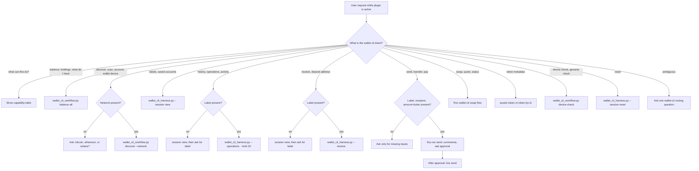

# Wallet CLI Harness Decision Tree

Use this tree to route user language into the official `wallet-cli` command surface.

Allowed command surfaces:

- `python3 scripts/wallet_cli_workflow.py ...`
- `python3 scripts/wallet_cli_harness.py -- ...`
- `wallet-cli ... --help` for raw official help text

Do not use local secret-store files, operating-system hardware scans, direct blockchain endpoint queries, remembered balances, or unrelated wallet tools for wallet-cli tasks.

## Intent Table

| User intent | Required inputs | Action |
| --- | --- | --- |
| What can this plugin do? | none | Show capability table, then ask what to run |
| Check wallet, balance, holdings | none | `python3 scripts/wallet_cli_workflow.py balance-all` |
| Find wallet device, discover accounts, scan wallet | network | `python3 scripts/wallet_cli_workflow.py discover --network <network>` |
| Saved labels | none | `python3 scripts/wallet_cli_harness.py -- session view` |
| Transaction history | account label | `python3 scripts/wallet_cli_harness.py -- operations <label> --limit 20` |
| Receive/deposit address | account label, verification preference | `receive <label>` or `receive <label> --no-verify` |
| Send/transfer/pay | account label, recipient, amount with ticker | dry-run `send`, summarize, ask approval, then live `send` |
| Swap/convert/trade | from, to, amount, account, provider as needed | `swap quote`, `swap execute`, or `swap status` |
| Token metadata | network + address, or token id | `assets token` or `assets token-by-id` |
| Device/genuine check | none | `python3 scripts/wallet_cli_workflow.py device-check` |
| Reset session | none | `session reset` |

## Reporting Rules

- Report concrete values from the final JSON object.
- Mention how many labels/accounts were checked.
- For balances, list nonzero balances first, then zero labels.
- For sends, summarize recipient, amount, and fee before asking for approval.
- For command errors, report the wallet-cli error and ask whether to retry or adjust inputs.
- For device checks, use the bounded `device-check` workflow. If it times out, report the timeout JSON and stop instead of continuing to wait.
